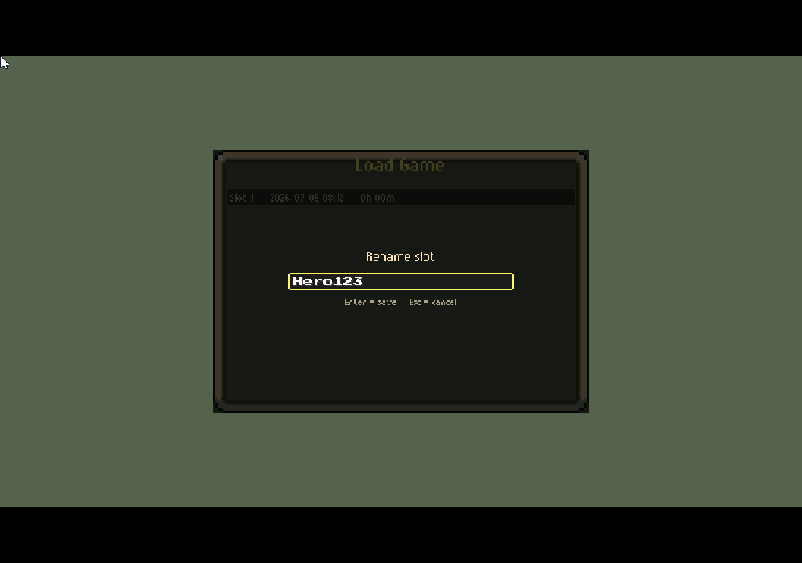
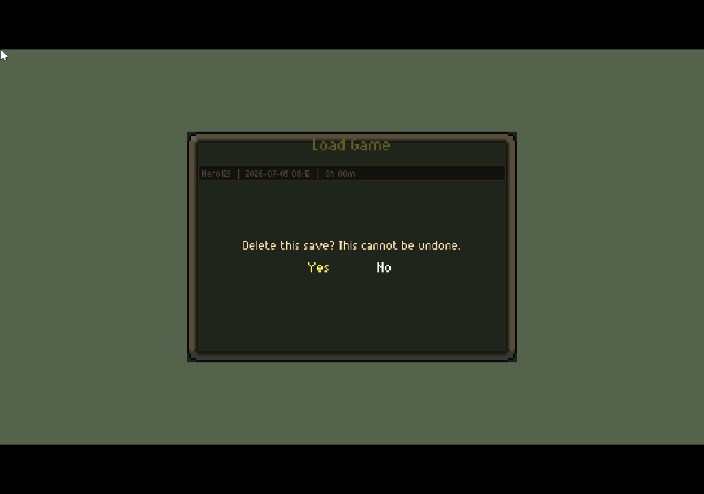
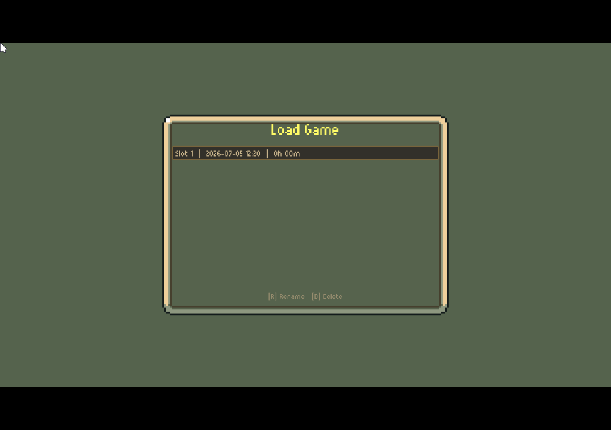
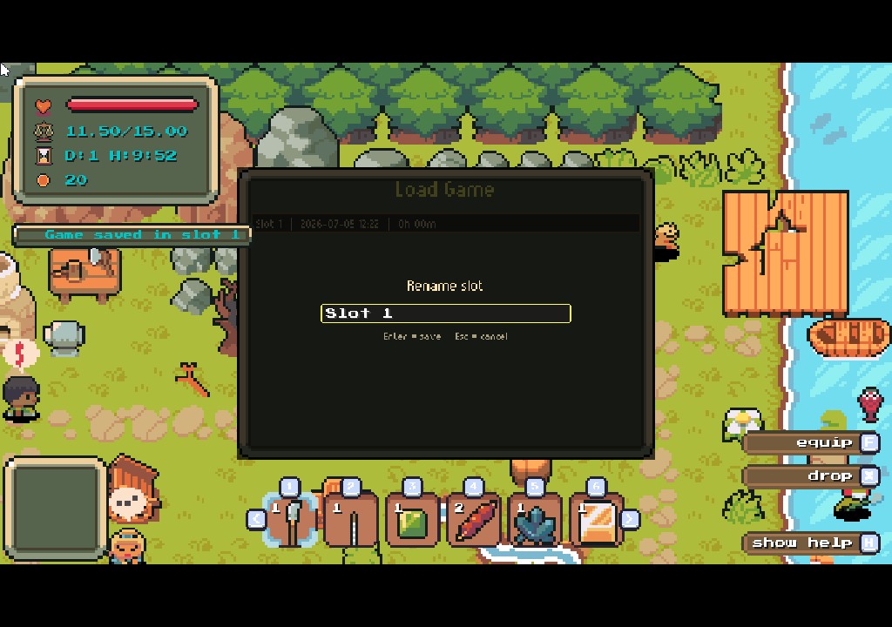
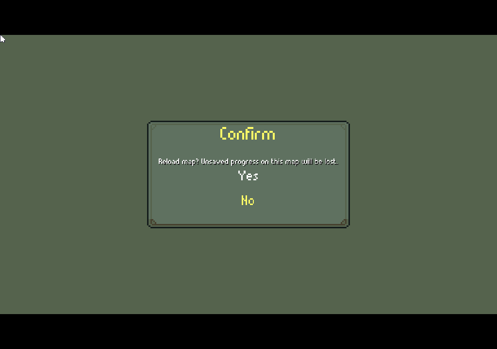
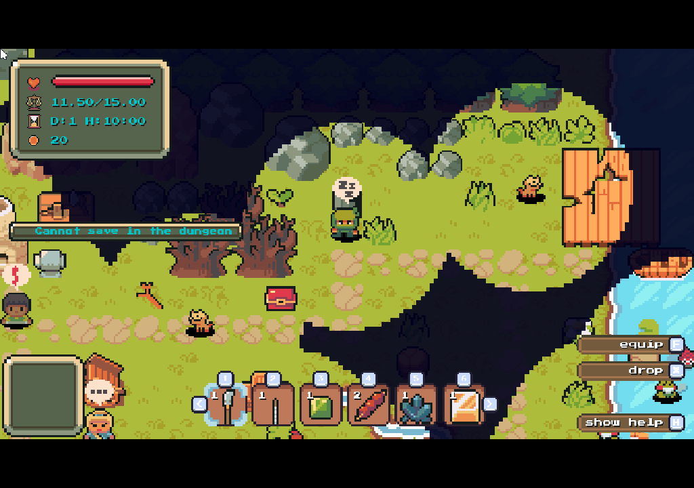

# T-021 — Panel zarządzania slotami zapisu w menu głównym (edycja nazwy, usuwanie)

**Rozszerzenie istniejącego `LoadPanel`** (`project/ui/panels/save_load.py`) o zarządzanie slotami z zapisaną grą: **zmiana nazwy** slotu (z użyciem widgetu `TextInput` z T-020) oraz **usuwanie** slotu z potwierdzeniem. Nie tworzymy osobnego panelu - dokładamy akcje do panelu, który już wyświetla listę slotów. To jednocześnie pierwszy realny konsument `TextInput` - służy jako test integracyjny tego widgetu w prawdziwym UI. Przy okazji popraw błąd polegający na tym, że po wczytaniu gry z LoadPanel, gra prawidłowo się wznawia, ale naciśnięcie Esc zamiast pokazać MainMenu wychodzi z gry.

## 🎯 Goal / Outcome

- [x] `LoadPanel` (`save_load.py`) rozszerzony o akcje na zaznaczonym slocie: „Rename" (klawisz R) i „Delete" (klawisz D, także Del) przy zaznaczonym slocie. Dostępne tam, gdzie `LoadPanel` już działa - w tym w menu głównym
- [x] **Edycja nazwy** zaznaczonego slotu: pole `TextInput` (z T-020) prefill aktualną nazwą, limit **20 znaków**, dozwolone **litery łacińskie, cyfry i spacje** (własny `predicate`); zapis nowej nazwy do metadanych slotu przez `SaveManager.rename_slot`
- [x] **Usuwanie** zaznaczonego slotu z modalem potwierdzenia („Delete this save? This cannot be undone.") - Yes/No (wzór z istniejącego confirm w `save_load.py`)
- [x] **Sanityzacja nazwy przy zapisie** (patrz Constraints) - `sanitize_slot_name` w `models.py`, wołana przy każdym ustawieniu `slot_name` (`save` + `rename_slot`)
- [x] Zmiany (nazwa/usunięcie) od razu widoczne na liście i trwałe (desktop: plik na dysku - zweryfikowane; web/localStorage: przez ten sam backend, weryfikacja web odłożona)
- [x] Anulowanie edycji nazwy (Esc) nie zmienia zapisanej nazwy
- [x] Działa na desktop (`./run.sh`) - zweryfikowane scenariuszem agentowym; web (`./serve_web.sh`) - weryfikacja odłożona na później (decyzja użytkownika)

## 🧭 Context

- **Silnik save/load już to wspiera częściowo:**
  - `project/save_load/backends.py` - każdy backend ma `delete_slot(slot_idx)` (desktop plikowy + web localStorage). Usuwanie jest gotowe na poziomie backendu
  - `project/save_load/manager.py:95` - `SaveManager.delete_slot(slot_idx)` (publiczne API)
  - `project/save_load/manager.py:55` - `SaveManager.save(slot_idx, slot_name="")` przyjmuje nazwę slotu
  - `project/save_load/models.py:77` - `SaveMetadata.slot_name: str` - pole nazwy już istnieje w modelu
  - `SaveManager.list_slots()` → `list[SaveSlotInfo | None]` - dane do wyświetlenia listy
  - **Brakuje** metody „rename" (zmiana samej nazwy bez ponownego zapisu całego stanu) - trzeba dodać np. `SaveManager.rename_slot(slot_idx, new_name)` (odczyt slotu → podmiana `metadata.slot_name` → zapis), albo cienką operację na backendzie
- **Panel do rozszerzenia:** `project/ui/panels/save_load.py` (`LoadPanel` / `SaveLoadPanel`) - layout listy slotów, nawigacja, klik. Tu dokładamy akcje Rename/Delete na zaznaczonym slocie
- **UI menu głównego:** `project/ui/panels/main_menu.py` - `LoadMenuScreen` + proxy (`_LoadUIManagerProxy`, `_LoadSceneProxy`) pokazują, jak `LoadPanel` działa w menu bez realnej sceny. Rozszerzony `LoadPanel` automatycznie dostanie nowe akcje w tym kontekście - zweryfikuj, że proxy obsłużą modal usunięcia i `TextInput`
- **Modal potwierdzenia:** `project/ui/panels/modal.py` - dialog Yes/No z callbackami (do potwierdzenia usunięcia)
- **Sanityzacja/serializacja save:** plik zapisu to JSON - patrz `project/save_load/models.py` (`to_dict`/`from_dict`, `SaveMetadata.slot_name`) i ścieżka zapisu w `backends.py` (`write_slot`). Normalizację nazwy najlepiej umieścić przy ustawianiu `slot_name` (w `rename_slot` / `save`), żeby żaden przepływ jej nie ominął

## ⛓️ Constraints

- **DEPENDENCY: wymaga widgetu `TextInput` z [[T-020 Widget pola tekstowego (TextInput) w module UI]].** Edycja nazwy slotu korzysta z `TextInput` (fokus, `max_length=20`, znaki: litery łacińskie + cyfry + spacja). Ten task zaczynać dopiero po ukończeniu (lub przynajmniej dostępności `TextInput` w `project/ui/widgets/`). To jednocześnie pierwszy realny test integracyjny `TextInput`
- **Rozszerz `LoadPanel`, nie twórz nowego panelu.** Użyj istniejących komponentów: `Widget`, `LoadPanel`/`SaveLoadPanel`, `Modal`, `TextInput`
- **Nazwa slotu:** maks. **20 znaków**, dozwolone **litery łacińskie, cyfry i spacje**. W `TextInput` może to wymagać charsetu „litery+cyfry+spacja" (w T-020 przewidziano rozszerzalny charset / własny predicate - użyj go, nie dokładaj diakrytyków)
- **Sanityzacja nazwy przy zapisie (obrona w głąb, wymóg na przyszłość):** niezależnie od filtra w UI, przy zapisie nazwy do metadanych (`rename_slot` / `save`, ustawienie `SaveMetadata.slot_name`) nazwa musi być **znormalizowana**, tak by nigdy nie zepsuła formatu pliku save (JSON) ani layoutu:
  - przytnij do 20 znaków (`[:20]`)
  - usuń znaki sterujące / niedrukowalne oraz znaki nowej linii i tabulacje (`\n`, `\r`, `\t`), `strip()` białych znaków z brzegów
  - serializacja przez `json.dumps` (już używana) escapuje cudzysłowy/backslashe - **nie** buduj JSON ręcznie ze sklejania stringów
  - dzięki temu ewentualne późniejsze rozszerzenie listy dopuszczalnych znaków w UI nie może uszkodzić pliku save - sanityzacja przy zapisie jest ostatnią linią obrony
- **Nie duplikuj logiki save/load** - operacje na slotach wyłącznie przez `SaveManager` (`delete_slot`, nowa `rename_slot`), nie grzeb bezpośrednio w plikach/localStorage z poziomu UI
- **Web (pygbag):** usuwanie i zmiana nazwy muszą działać także na backendzie localStorage
- Trzymaj się reguł z `project/AGENTS.md` (styl, mypy)

## 🪜 Plan / Subtasks

- [x] Dodaj funkcję sanityzacji nazwy slotu (`sanitize_slot_name` w `models.py`: usuń znaki niedrukowalne/sterujące/`\n`/`\r`/`\t`, `strip()`, przytnij do `MAX_SLOT_NAME_LEN=20`) i wołaj przy każdym ustawieniu `slot_name`
- [x] Dodaj `SaveManager.rename_slot(slot_idx, new_name)` (odczyt → sanityzacja → zmiana `metadata.slot_name` → zapis); ta sama sanityzacja w `save(slot_idx, slot_name=...)`
- [x] Rozszerz `LoadPanel`/`SaveLoadPanel` (`save_load.py`) o akcje „Rename" (R) / „Delete" (D, także Del) na zaznaczonym slocie
- [x] Zweryfikuj, że rozszerzony `LoadPanel` działa w menu głównym (`LoadMenuScreen` + proxy) - modal usunięcia i `TextInput` obsłużone także tam (zweryfikowane scenariuszem „Manage Saves")
- [x] Edycja nazwy: otwarcie `TextInput` (prefill aktualną nazwą, `max_length=20`, predykat litery łacińskie + cyfry + spacja), zatwierdzenie (Enter) → `rename_slot`, Esc → anuluj
- [x] Usuwanie: confirm Yes/No → `delete_slot` → odświeżenie listy
- [x] Odświeżanie listy po każdej operacji (nazwa/usunięcie), z korektą zaznaczenia po skróceniu listy
- [x] Scenariusz testów agentowych w `tests/scenarios.json` („Manage Saves"): wejście do `LoadPanel`, zmiana nazwy slotu (`type:`/`backspace`), usunięcie slotu z potwierdzeniem; screenshoty w punktach kontrolnych - **przechodzi na desktop** (web odłożony)
- [x] Test/asercja sanityzacji + rename: `tests/test_save_load_models.py` (4 testy sanityzacji, w tym JSON round-trip) i `tests/test_save_load_backends.py` (3 testy `rename_slot`)
- [x] mypy bez nowych błędów (11 błędów, wszystkie pre-existing, żaden w zmienionych liniach); desktop zweryfikowany, web odłożony

## ✅ Definition of Done

- [x] Rozszerzony `LoadPanel` ma akcje „Rename" i „Delete" na zaznaczonym slocie (działają też w menu głównym)
- [x] Zmiana nazwy slotu przez `TextInput` (maks. 20 znaków, litery łacińskie + cyfry + spacja) działa i jest trwała na **desktop** (web odłożony - ten sam `SaveManager`/backend)
- [x] Usuwanie slotu z potwierdzeniem działa i jest trwałe na **desktop** (web odłożony)
- [x] Sanityzacja nazwy przy zapisie: nawet nazwa ze znakami sterującymi / za długa nie psuje pliku save (JSON), plik nadal się wczytuje (test `test_sanitize_slot_name_survives_json_roundtrip`)
- [x] Anulowanie edycji nazwy (Esc) nie zmienia zapisu; puste sloty nie mają akcji rename/delete (guard w `_begin_rename`/`_begin_delete`)
- [x] Lista odświeża się po każdej operacji
- [x] Scenariusz testów agentowych „Manage Saves" przechodzi na **desktop** (`tests/automate_display_test.py`); web odłożony (decyzja użytkownika)
- [x] mypy nie zgłasza nowych błędów
- [x] zmiany udokumentowane w tasku (`moab log`)
- [x] na końcu tej sekcji "✅ Definition of Done" dodane jest zdjęcie potwierdzające prawidłowe działanie (panel z edycją nazwy i potwierdzeniem usunięcia)
- [x] W razie potrzeby odpowiednie pliki AGENTS.md są zaktualizowane (`project/AGENTS.md` - akcje `slot_rename`/`slot_delete`)
- [x] commit zmian wykonany
- [x] **Bonus (z opisu zadania):** naprawiony błąd - po wczytaniu gry z `LoadPanel` w menu głównym Esc pokazuje MainMenu zamiast wychodzić z gry (`main_menu.py:_on_load` zostawia `[MainMenuScreen, Scene]` na stosie stanów)

### Dowód działania

Rename (edycja nazwy przez `TextInput`, prefill + predykat litery/cyfry/spacja):

Delete (modal potwierdzenia Yes/No):

## 📓 Agent Log

- 2026-07-05 07:57 cc: claimed, starting
- 2026-07-05 08:20 cc: zaimplementowane. `sanitize_slot_name`+`MAX_SLOT_NAME_LEN` (models.py), `SaveManager.rename_slot` + sanityzacja w `save()` (manager.py), akcje Rename(R)/Delete(Del) w `SaveLoadPanel` z inline `TextInput` i confirm usuwania (save_load.py), ACTIONS `slot_rename`/`slot_delete` (settings.py). Bonus: fix Esc-po-load w `main_menu.py`. Testy: +4 sanityzacja (test_save_load_models), +3 rename (test_save_load_backends) - wszystkie zielone. Scenariusze agentowe „Manage Saves" i „Load from Menu then Esc" (scenarios.json) przechodzą na desktop, screenshoty potwierdzają. mypy: brak nowych błędów. Web odłożony na życzenie użytkownika.
- 2026-07-05 08:20 cc: Implemented: sanitize_slot_name + rename_slot, Rename(R)/Delete(Del) actions in SaveLoadPanel with inline TextInput and delete confirm; Esc-after-load fix. 7 new unit tests green, Manage Saves agent scenario passes on desktop; web deferred.
- 2026-07-05 08:22 cc: Rename(R)/Delete(Del) w Save/Load panelu + sanityzacja nazw + rename_slot; bonus fix Esc-po-load. 7 testów jednostkowych zielone, scenariusz agentowy Manage Saves przechodzi na desktop (screenshoty w DoD). Web odłożony na życzenie. Test: just mypy; .venv/bin/python tests/test_save_load_models.py; .venv/bin/python tests/test_save_load_backends.py; .venv/bin/python3 tests/automate_display_test.py 'Manage Saves'.
- 2026-07-05 08:40 user: odkryte błędy:
- na LoadPanel, po naciśnięciu 'r' pojawia się panel Rename, ale dodaje się na końcu nazwy slotu litera 'r'
- na LoadPanel, etykieta Load Game jest za wysoko i zachodzi na ramkę, a dolna etykieta (Rename i Delete) jest za nisko i też zachodzi
- jeżeli LoadPanel zostanie otworzony w trakcie gry przez F9, to naciśnięcie klawiszy obsługuje panel ale jednocześnie dalej jest przetwarzane przez grę, a przycisk R zamiast rename slot robi reset gry. Gra powinna być zatrzymana w trakcie wyświetlania panelu Load
- przy okazji, niech przycisk r w trakcie gry wyświetla panel z prośbą o potwierdzenie resetu, bo jest to nieodwracalne
- jeżeli gracz w trakcie gry naciśnie Esc to w menu głównym ma jedynie Save i Load - a powinien mieć jeszcze Continue aby wznowić trwającą grę bez zmian. Continue ma się nie pokazywać póki nie będzie rozpoczęta jakąkolwiek gra.
- na LoadPanel, trzeba nacisnąć przycisk Delete aby usunąć slot, ale takiego przycisku nie na małych laptopowych klawiaturach - niech to będzie litera 'd'
- zapis gry powinien być zabroniony w lochach/labiryncie (maze). Jeśli gracz naciśnie tam FT powinno pojawić się powiadomienie po lewej, że zapis w tej lokalizacji jest niemożliwy
- 2026-07-05 12:09 cc: claimed, starting
- 2026-07-05 12:30 cc: naprawione wszystkie 7 uwag (desktop, screenshoty poniżej):
  1. **Stray 'r'** - klawisz R otwiera edytor i wysyła też `TEXTINPUT "r"`; dodany `_swallow_next_textinput` w `save_load.py` pochłania ten jeden znak (czyszczony po klatce, żeby nie zjeść realnego wpisywania). Slot renamuje się na czyste „Hero123".
  2. **Layout** - tytuł i podpowiedź zachodziły na ramkę 9-patch; lista slotów liczona od `_list_top()` (pod tytułem), tytuł na `top+_HEADER_Y`, podpowiedź na `bottom-_FOOTER_Y`.
  3. **Pauza przy panelu w grze** - `GameUI.is_modal_open()` (LoadPanel/SavePanel); `Scene.update` zamraża świat i `reset_inputs()` gdy panel otwarty (próbkowane PRZED `ui.update`, więc Esc zamykający panel nie wycieka do menu). R w panelu robi rename, nie reset mapy.
  4. **Potwierdzenie reload (R w grze)** - nowy `ConfirmMenuScreen` (Yes/No, domyślnie **No**); `Scene` woła go przed `reload_map`.
  5. **Continue w menu z gry** - Esc w scenie **wypycha** świeży `MainMenuScreen` na stos (zamiast `exit_state`, który niszczył grę); menu pokazuje Continue (bo gra trwa), Continue = `exit_state` wraca do tej samej gry. Continue tylko gdy `_is_game_in_progress()`.
  6. **Delete → 'd'** - `slot_delete` teraz `K_d` (panel obsługuje `K_d` i `K_DELETE`), podpowiedź „[D] Delete".
  7. **Zakaz zapisu w maze** - F5 w scenie z `is_maze=True` pokazuje powiadomienie „Cannot save in the dungeon" (blok w `game.py`); nowa komenda agenta `debug_set_maze` do testu.
  Scenariusze agentowe: „In-Game LoadPanel Paused", „In-Game Reload Confirm", „In-Game Esc Shows Continue", „Maze Save Blocked" - wszystkie przechodzą na desktop. mypy: brak nowych błędów; testy jednostkowe zielone.

### Dowód działania (poprawki)

LoadPanel - poprawiony layout (tytuł/podpowiedź nie zachodzą na ramkę, „[D] Delete"):

W grze (F9): panel zamraża świat, R otwiera Rename zamiast resetować mapę:

R w grze - potwierdzenie resetu mapy (domyślnie No):

Esc w grze - menu z Continue (wznawia bez zmian):

F5 w lochu/maze - zapis zablokowany z powiadomieniem:

- 2026-07-05 12:30 cc: Naprawione wszystkie 7 uwag z review (stray 'r', layout, pauza panelu w grze, potwierdzenie reload, Continue w menu z gry, Delete->d, zakaz zapisu w maze). Zweryfikowane 4 nowymi scenariuszami agentowymi na desktop, screenshoty w tasku. mypy bez nowych błędów, testy jednostkowe zielone.
- 2026-07-05 14:16 cc: Follow-up: menu otwierane w grze (Esc/F2) nie miało tła (bg_image=None). Zapisane game.menu_bg_image i przekazywane przy pushu MainMenuScreen ze sceny - teraz to samo tło co menu startowe. Zweryfikowane screenshotem.
- 2026-07-05 14:25 cc: Fix: Load z MainMenu + Esc zamykał grę (panel konsumował event Esc, ale INPUTS['quit'] wyciekał do MainMenuScreen pod spodem -> quit). LoadMenuScreen._on_cancel woła reset_inputs(). Dodany hotkey F7 (akcja text_demo) do otwierania ekranu demo TextInput z dowolnego miejsca. Scenariusze 'Menu Load Cancel Returns to Menu' i 'TextInput Demo Hotkey' przechodzą na desktop.

## 🙋 Needs-You / Questions

- Ustalone (2026-07-05): nazwa slotu maks. 20 znaków; dozwolone litery łacińskie, cyfry i spacje. Sanityzacja przy zapisie jako obrona na wypadek przyszłego rozszerzenia listy znaków (patrz Constraints).

